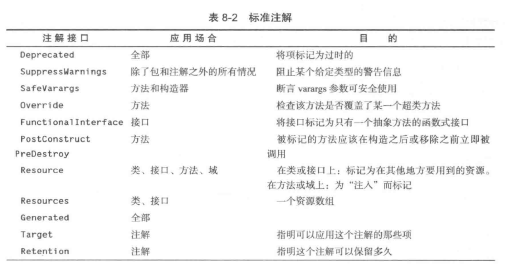
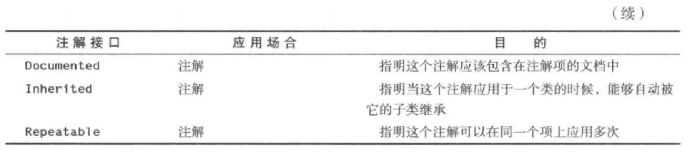

# Java中的注解

> 参考：《Java核心技术 卷2》

## 1.什么是注解

注解是一种`标签`🏷️，可以在源代码中进行插入，随后可以调用***相应的工具***来对其进行处理。

这些工具可以在源代码的层次上进行处理，也可以在编译器层次上进行处理。

！但是，注解不会改变虚拟机的编译方式，最后生成的虚拟机指令是一致的。

## 2.注解的工作原理

注解本身并不会做任何事情，需要用对应的工具去读取并进行处理。每一个注解都必须通过一个**注解接口**进行定义，再实现一个具体的类用来进行实际的处理。

注解接口的示例如下：

```java
@Target(ElementType.Method)
@Retention(RetentionPolicy.Runtime)//以上为元注解，所有的注解都会用到
public @interface AnnotationName {
  //注解元素的格式如下
  type elementName() default value;
  ....
}

@AnnontationName(elementName1=value1,elementName2=value2,...)
public void doSomething(){...}
```

### 在Runtime中注解的工作流程

- 对某个对象使用`getDeclaredMethods()`方法，获取其所有方法
- 对每个方法调用`getAnnotation(XXAnnotation.class)`方法，获取某一类注解
- 构造一个实现了注解接口的[代理对象](https://blog.csdn.net/xiaowu_zhu/article/details/83019440)，在该对象中调用被注解的方法。

> #问题：是否每个对象都需要判断是否有注解？如何确定改判断的注解类型？

因此注解是编译器计算来的，所以所有的元素值必须是编译器常量！

### 源码级注解处理


## 3.注解出现的位置

### 3.1 声明

包括：包、类、接口、方法、构造器、实例域、局部变量、参数变量、类型参数

声明注解提供了正在被声明的项的信息，如下断言userId非空

```java
public User getUser(@NonNull String userId)
```

### 3.2 类型用法

将注解放在引用类型元前，如下表示List中的所有字符串都不为空

```java
List<@NonNull String>
```

#TODO 暂时无法特别理解

## 4.标准注解





以上为Java SE中给出的标准注解。