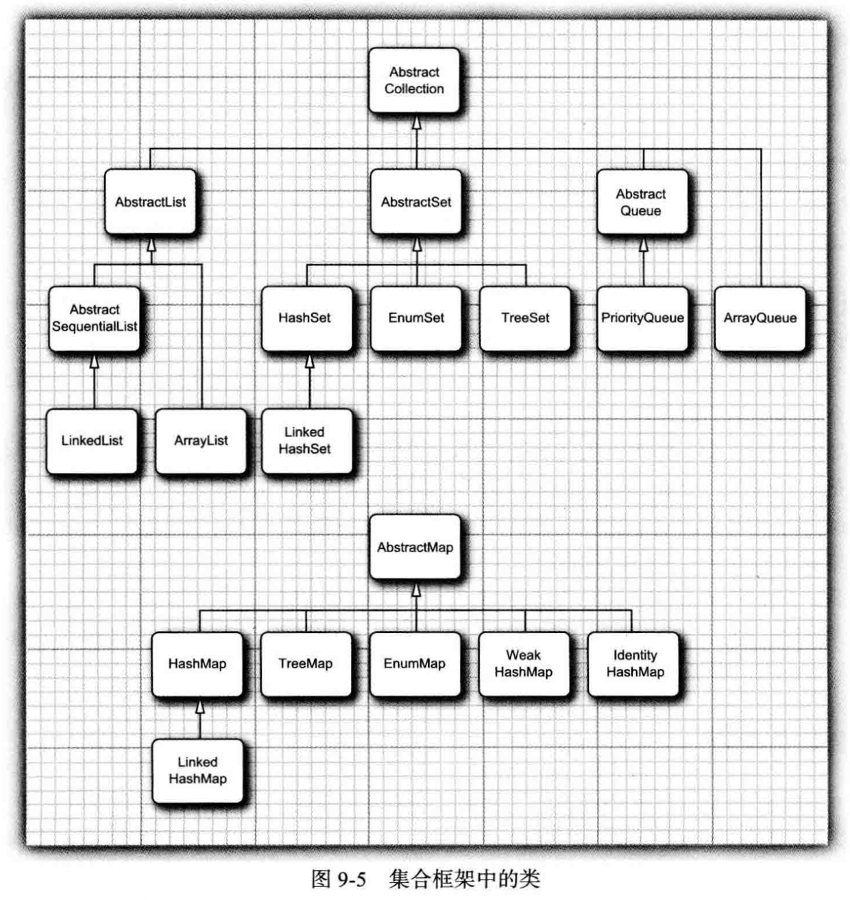

# Java集合类总结 #

1. 底层数据结构
1. 增删改查方式
1. 初始容量，扩容方式，扩容时机。
1. 线程安全与否
1. 是否允许空，是否允许重复，是否有序

## Colletion，iterator，comparable ##

一般认为Collection是最上层接口，但是hashmap实际上实现的是Map接口。

iterator是迭代器，是实现iterable接口的类必须要提供的一个东西，能够使用for(i : A) 这种方式实现的类型能提供迭代器。

实现comparable接口可以让一个类的实例互相使用compareTo方法进行比较大小，可以自定义比较规则，comparator则是一个通用的比较器，比较指定类型的两个元素之间的大小关系。

### iterator

1、在Java中Iterator为一个接口，它只提供了迭代了基本规则，在JDK中他是这样定义的：对 collection 进行迭代的迭代器。

2、fail-fast机制 

当多个线程对集合进行结构上的改变的操作时，有可能会产生fail-fast机制。

记住是有可能，而不是一定。例如：假设存在两个线程（线程1、线程2），线程1通过Iterator在遍历集合A中的元素，在某个时候线程2修改了集合A的结构（是结构上面的修改，而不是简单的修改集合元素的内容），那么这个时候程序就会抛出 ConcurrentModificationException异常，从而产生fail-fast机制。

判断机制：

检测 modCount == expectedModCount ，若不等则抛出ConcurrentModificationException 异常，从而产生fail-fast机制。

expectedModCount 是在Itr中定义的：

	int expectedModCount = ArrayList.this.modCount;
所以他的值是不可能会修改的，所以会变的就是modCount。modCount是在 AbstractList 中定义的，为全局变量：

	protected transient int modCount = 0;
ArrayList中无论add、remove、clear方法只要是涉及了改变ArrayList元素的个数的方法都会导致modCount的改变。

## List-ArrayList-Vector-Stack-LinkedList ##

List接口下的实现类有ArrayList，linkedlist，vector等等。

ArrayList的扩容方式是1.5倍扩容，这样扩容避免2倍扩容可能浪费空间，是一种折中的方案。 另外他不是线程安全，vector则是线程安全的，它是两倍扩容的。

linkedlist多用于实现链表。

### ArrayList 

1、ArrayList继承AbstractList抽象父类，实现了List接口（规定了List的操作规范）、RandomAccess（可随机访问）、Cloneable（可拷贝）、Serializable（可序列化）。

2、底层数据结构：ArrayList的底层是一个object数组，并且由transient修饰（不会参与序列化）。

	transient Object[] elementData;

3、增删改查

- 增：void add(int index, E element)

	添加元素时，首先判断索引是否合法，然后检测是否需要扩容，最后使用System.arraycopy方法来完成数组的复制。

- 删： E remove(int index)

	删除元素时，同样判断索引是否和法，删除的方式是把被删除元素右边的元素左移，方法同样是使用System.arraycopy进行拷贝。

	clear()：ArrayList提供一个清空数组的办法，方法是将所有元素置为null，这样就可以让GC自动回收掉没有被引用的元素了。

- 改： E set(int index, E element)

	修改元素时，只需要检查下标即可进行修改操作。

- 查： E get(int index)

	只需要检查下标

4、扩容：

初始容量是10。扩容方式是让新容量等于旧容量的1.5倍。

在每次添加新的元素时，ArrayList都会检查是否需要进行扩容操作，扩容操作带来数据向新数组的重新拷贝，所以如果我们知道具体业务数据量，在构造ArrayList时可以给ArrayList指定一个初始容量，这样就会减少扩容时数据的拷贝问题。

5、线程安全：ArrayList是线程不安全的。在其迭代器iteator中，如果有多线程操作导致modcount改变，会执行fail-fast。抛出异常。

为了保证同步，最好的办法是在创建时完成：

	List list = Collections.synchronizedList(new ArrayList(...)); 

6、优点：访问很快、顺序添加很快；缺点：删除和插入涉及到元素复制，很耗费性能

因此，ArrayList比较适合顺序添加、随机访问的场景。

### Vector

1、Vector实现List接口，继承AbstractList类，实现RandmoAccess接口，即提供了随机访问功能，提供提供快速访问功能，实现了Cloneable接口，支持clone()方法，可以被克隆。

2、底层数据结构：vector底层数组不加transient，序列化时会全部复制

3、扩容：扩容方式与ArrayList基本一样，但是扩容时不是1.5倍扩容，而是有一个扩容增量。

如果在创建Vector时，指定了扩容增量的大小；则，每次当Vector中动态数组容量增加时，增加的大小都是扩容增量。如果容量的增量小于等于零，则每次需要增大容量时，向量的容量将增大一倍。

4、线程安全：vector大部分方法都使用了synchronized修饰符，所以他是线层安全的集合类。

### ArrayList和Vector的区别

1、Vector是线程安全的，ArrayList是线程非安全的

2、Vector可以指定增长因子，如果不指定增长因子，则扩容两倍；ArrayList扩容1.5倍。

### stack

1、继承Vector类

2、Stack通过五个操作对Vector进行扩展

	empty()
	测试堆栈是否为空。
	peek()
	查看堆栈顶部的对象，但不从堆栈中移除它。
	pop()
	移除堆栈顶部的对象，并作为此函数的值返回该对象。
	push(E item)
	把项压入堆栈顶部。
	search(Object o)
	返回对象在堆栈中的位置，以 1 为基数。

### LinkedList

1、数据结构

LinkedList是一个双向链表。

#### 属性

在LinkedList中提供了两个基本属性size、header。

	private transient Entry header = new Entry(null, null, null); 
	private transient int size = 0;

 其中size表示的LinkedList的大小，header表示链表的表头，Entry为节点对象。

	private static class Entry<E> {
	    E element;        //元素节点
	    Entry<E> next;    //下一个元素
	    Entry<E> previous;  //上一个元素
	
	    Entry(E element, Entry<E> next, Entry<E> previous) {
	        this.element = element;
	        this.next = next;
	        this.previous = previous;
	    }
	}

#### 构造方法

LinkedList提供了两个构造方法：LinkedList()和LinkedList(Collection<? extends E> c)。

	/**
	     *  构造一个空列表。
	     */
	    public LinkedList() {
	        header.next = header.previous = header;
	    }
	    
	    /**
	     *  构造一个包含指定 collection 中的元素的列表，这些元素按其 collection 的迭代器返回的顺序排列。
	     */
	    public LinkedList(Collection<? extends E> c) {
	        this();
	        addAll(c);
	    }

2、增删改查

- 增：

		add(E e): 将指定元素添加到此列表的结尾。

		add(int index, E element)：在此列表中指定的位置插入指定的元素。
	
		addAll(Collection<? extends E> c)：添加指定 collection 中的所有元素到此列表的结尾，顺序是指定 collection 的迭代器返回这些元素的顺序。
	
		addAll(int index, Collection<? extends E> c)：将指定 collection 中的所有元素从指定位置开始插入此列表。
	
		AddFirst(E e): 将指定元素插入此列表的开头。
	
		addLast(E e): 将指定元素添加到此列表的结尾。

- 删

		remove(Object o)：从此列表中移除首次出现的指定元素（如果存在）。

		clear()： 从此列表中移除所有元素。
	
		remove()：获取并移除此列表的头（第一个元素）。
	
		remove(int index)：移除此列表中指定位置处的元素。
	
		remove(Objec o)：从此列表中移除首次出现的指定元素（如果存在）。
	
		removeFirst()：移除并返回此列表的第一个元素。
	
		removeFirstOccurrence(Object o)：从此列表中移除第一次出现的指定元素（从头部到尾部遍历列表时）。
	
		removeLast()：移除并返回此列表的最后一个元素。
	
		removeLastOccurrence(Object o)：从此列表中移除最后一次出现的指定元素（从头部到尾部遍历列表时。

- 查

		  get(int index)：返回此列表中指定位置处的元素。
		
		  getFirst()：返回此列表的第一个元素。
		
		  getLast()：返回此列表的最后一个元素。
		
		  indexOf(Object o)：返回此列表中首次出现的指定元素的索引，如果此列表中不包含该元素，则返回 -1。
		
		  lastIndexOf(Object o)：返回此列表中最后出现的指定元素的索引，如果此列表中不包含该元素，则返回 -1。

3、线程不安全

4、优点：插入和删除消耗的资源少；缺点：查找消耗的资源大，效率低，不能随机访问。

## Queue-Deque-ArrayDeque-PriorityQueue

Queue接口定义了队列数据结构，元素是有序的(按插入顺序)，先进先出。

### Deque

Deque接口，继承了Queue接口，创建双向队列，灵活性更强，可以前向或后向迭代，在队头队尾均可心插入或删除元素。它的两个主要实现类是ArrayDeque和LinkedList。

### ArrayDeque

底层使用循环数组实现双向队列

### PriorityQueue

1、底层用数组实现堆的结构

优先队列跟普通的队列不一样，普通队列是一种遵循FIFO规则的队列，拿数据的时候按照加入队列的顺序拿取。 而优先队列每次拿数据的时候都会拿出优先级最高的数据。

优先队列内部维护着一个堆，每次取数据的时候都从堆顶拿数据（堆顶的优先级最高），这就是优先队列的原理。

2、增删改查

- add(E e)；添加到最后一个节点，然后上滤。
- poll()；得到堆顶元素，然后将最后一个节点放到堆顶，下滤
- remove(Object o)；删除元素，然后将最后一个节点放到该位置，先下滤，再上滤。

3、线程安全：PriorityQueue不是一个线程安全的类，如果要在多线程环境下使用，可以使用 PriorityBlockingQueue 这个优先阻塞队列。其中add、poll、remove方法都使用 ReentrantLock 锁来保持同步，take() 方法中如果元素为空，则会一直保持阻塞。

## Map-HashMap-HashTable ##

### 定义

HashMap实现了Map接口，继承AbstractMap。其中Map接口定义了键映射到值的规则，而AbstractMap类提供 Map 接口的骨干实现，以最大限度地减少实现此接口所需的工作

### 数据结构

hashmap是数组和链表的组合结构。

数组是一个Entry数组，entry是k-V键值对类型（包括hash、key、val、next指针），所以一个entry数组存着很多entry节点，一个entry的位置通过key的hashcode方法，再进行hash，最后与表长-1进行相与操作，其实就是取hash值到的后n - 1位，n代表表长是2的n次方。JDK1.8在链表长度超过8时会转换为红黑树，进一步提升了性能。

	HashMap提供了三个构造函数：
	
	  HashMap()：构造一个具有默认初始容量 (16) 和默认加载因子 (0.75) 的空 HashMap。
	
	  HashMap(int initialCapacity)：构造一个带指定初始容量和默认加载因子 (0.75) 的空 HashMap。
	
	  HashMap(int initialCapacity, float loadFactor)：构造一个带指定初始容量和加载因子的空 HashMap。

在这里提到了两个参数：初始容量，加载因子。

这两个参数是影响HashMap性能的重要参数，其中容量表示哈希表中桶的数量，初始容量是创建哈希表时的容量，加载因子是哈希表在其容量自动增加之前可以达到多满的一种尺度，它衡量的是一个散列表的空间的使用程度，负载因子越大表示散列表的装填程度越高，反之愈小。

对于使用链表法的散列表来说，查找一个元素的平均时间是O(1+a)，因此如果负载因子越大，对空间的利用更充分，然而后果是查找效率的降低；如果负载因子太小，那么散列表的数据将过于稀疏，对空间造成严重浪费。系统默认负载因子为0.75，一般情况下我们是无需修改的。

### 扩容

hashmap的默认负载因子是0.75，阈值是16 * 0.75 = 12；初始长度为16；进行两倍扩容。

HashMap的初始容量是2的n次幂,扩容也是2倍的形式进行扩容,是因为容量是2的n次幂,可以使得添加的元素均匀分布在HashMap中的数组上,减少hash碰撞。

Map扩容操作的核心在于重哈希。所谓重哈希是指重新计算原HashMap中的元素在新table数组中的位置并进行复制处理的过程。

### 增删改查

hashmap的增删改查方式比较简单，都是遍历，替换。有一点要注意的是key相等时，替换元素，不相等时连成链表。

#### 存储实现：put(key,vlaue)

	public V put(K key, V value) {
	        //当key为null，调用putForNullKey方法，保存null与table第一个位置中，这是HashMap允许为null的原因
	        if (key == null)
	            return putForNullKey(value);
	        //计算key的hash值，此处对原来元素的hashcode进行了再次hash
	        int hash = hash(key.hashCode());                  ------(1)
	        //计算key hash 值在 table 数组中的位置
	        int i = indexFor(hash, table.length);             ------(2)
	        //从i出开始迭代 e,找到 key 保存的位置
	        for (Entry<K, V> e = table[i]; e != null; e = e.next) {
	            Object k;
	            //判断该条链上是否有hash值相同的(key相同)
	            //若存在相同，则直接覆盖value，返回旧value
	            if (e.hash == hash && ((k = e.key) == key || key.equals(k))) {
	                V oldValue = e.value;    //旧值 = 新值
	                e.value = value;
	                e.recordAccess(this);
	                return oldValue;     //返回旧值
	            }
	        }
	        //修改次数增加1
	        modCount++;
	        //将key、value添加至i位置处
	        addEntry(hash, key, value, i);
	        return null;
	    }

1、寻找位置。计算key的hashcode的hash值，再搜索在table数组中的索引位置，其中indexFor方法如下：

	static int indexFor(int h, int length) {
	        return h & (length-1);
	    }
与表长-1进行相与操作，其实就是取hash值到的后n - 1位，n代表表长是2的n次方。

2、如果table数组在该位置处有元素，则通过比较是否存在相同的key，若存在则覆盖原来key的value，否则将该元素保存在链头（最先保存的元素放在链尾）。

#### 读取实现：get(key)

通过key的hash值找到在table数组中的索引处的Entry，然后返回该key对应的value即可。

	public V get(Object key) {
	        // 若为null，调用getForNullKey方法返回相对应的value
	        if (key == null)
	            return getForNullKey();
	        // 根据该 key 的 hashCode 值计算它的 hash 码  
	        int hash = hash(key.hashCode());
	        // 取出 table 数组中指定索引处的值
	        for (Entry<K, V> e = table[indexFor(hash, table.length)]; e != null; e = e.next) {
	            Object k;
	            //若搜索的key与查找的key相同，则返回相对应的value
	            if (e.hash == hash && ((k = e.key) == key || key.equals(k)))
	                return e.value;
	        }
	        return null;
	    }

### 线程安全 ###

hashmap的扩容操作，由于hashmap非线程安全，扩容时如果多线程并发进行操作，则可能有两个线程分别操作新表和旧表，导致节点成环，查询时会形成死锁。chm避免了这个问题。

### CHM ###

concurrenthashmap

chm1.7使用分段锁来控制并发。查询时不加锁。

1.8则放弃使用分段锁，改用cas+synchronized方式实现并发控制，查询时不加锁，插入时如果没有冲突直接cas到成功为止，有冲突则使用synchronized插入。cas：比较和交换（Conmpare And Swap）。

#### JDK1.7

首先将数据分为一段一段的存储，然后给每一段数据配一把锁，当一个线程占用锁访问其中一个段数据时，其他段的数据也能被其他线程访问。

#### JDK1.8

ConcurrentHashMap 取消了 Segment 分段锁，采用 CAS 和 synchronized 来保证并发安全。

synchronized 只锁定当前链表或红黑二叉树的首节点，这样只要 hash 不冲突，就不会产生并发，效率又提升 N 倍。

### HashMap和HashTable的区别

1、定义：HashTable基于Dictionary类，而HashMap是基于AbstractMap。

2、null值：HashMap可以允许存在一个为null的key和任意个为null的value，但是HashTable中的key和value都不允许为null。

3、线程安全：HashMap线程不安全，HashTable是线程安全的。HashMap内部实现没有任何线程同步相关的代码，所以相对而言性能要好一点。如果在多线程中使用HashMap需要自己管理线程同步。HashTable大部分对外接口都使用synchronized包裹，所以是线程安全的，但是性能会相对差一些。

4、初始长度：HashMap的初始长度为16，而HashTable的初始长度为11。HashMap中初始容量必须是2的幂,如果初始化传入的初始容量不是2的幂，将会自动调整为大于出入的初始容量最小的2的幂。

5、hash值计算：HashMap使用自己的计算hash的方法(会依赖key的hashCode方法)，HashTable则使用key的hashCode方法得到。

### ConcurrentHashMap 和 Hashtable 的区别

ConcurrentHashMap 和 Hashtable 的区别主要体现在实现线程安全的方式上不同。

- 底层数据结构： JDK1.7 的 ConcurrentHashMap 底层采用 分段的数组+链表 实现，JDK1.8 采用的数据结构跟 HashMap1.8 的结构一样，数组+链表/红黑二叉树。Hashtable 和 JDK1.8 之前的 HashMap 的底层数据结构类似都是采用 数组+链表 的形式，数组是 HashMap 的主体，链表则是主要为了解决哈希冲突而存在的；

- 实现线程安全的方式（重要）： ① 在 JDK1.7 的时候，ConcurrentHashMap（分段锁） 对整个桶数组进行了分割分段(Segment)，每一把锁只锁容器其中一部分数据，多线程访问容器里不同数据段的数据，就不会存在锁竞争，提高并发访问率。 到了 JDK1.8 的时候已经摒弃了 Segment 的概念，而是直接用 Node 数组+链表+红黑树的数据结构来实现，并发控制使用 synchronized 和 CAS 来操作。（JDK1.6 以后 对 synchronized 锁做了很多优化） 整个看起来就像是优化过且线程安全的 HashMap，虽然在 JDK1.8 中还能看到 Segment 的数据结构，但是已经简化了属性，只是为了兼容旧版本；② Hashtable(同一把锁) :使用 synchronized 来保证线程安全，效率非常低下。当一个线程访问同步方法时，其他线程也访问同步方法，可能会进入阻塞或轮询状态，如使用 put 添加元素，另一个线程不能使用 put 添加元素，也不能使用 get，竞争会越来越激烈效率越低。

## Set-HashSet ##

set就是hashmap将value固定为一个object，只存key元素包装成一个entry即可，其他不变。

### 定义

HashSet继承AbstractSet类，实现Set、Cloneable、Serializable接口。其中AbstractSet提供 Set 接口的骨干实现，从而最大限度地减少了实现此接口所需的工作。Set接口是一种不包括重复元素的Collection，它维持它自己的内部排序，所以随机访问没有任何意义。

### 数据结构
基于HashMap实现，底层使用HashMap保存所有元素，方法的实现过程也是基于HashMap的

构造函数

	/**
	     * 默认构造函数
	     * 初始化一个空的HashMap，并使用默认初始容量为16和加载因子0.75。
	     */
	    public HashSet() {
	        map = new HashMap<>();
	    }
	
	    /**
	     * 构造一个包含指定 collection 中的元素的新 set。
	     */
	    public HashSet(Collection<? extends E> c) {
	        map = new HashMap<>(Math.max((int) (c.size()/.75f) + 1, 16));
	        addAll(c);
	    }
	
	    /**
	     * 构造一个新的空 set，其底层 HashMap 实例具有指定的初始容量和指定的加载因子
	     */
	    public HashSet(int initialCapacity, float loadFactor) {
	        map = new HashMap<>(initialCapacity, loadFactor);
	    }
	
	    /**
	     * 构造一个新的空 set，其底层 HashMap 实例具有指定的初始容量和默认的加载因子（0.75）。
	     */
	    public HashSet(int initialCapacity) {
	       map = new HashMap<>(initialCapacity);
	    }
	
	    /**
	     * 在API中我没有看到这个构造函数，今天看源码才发现（原来访问权限为包权限，不对外公开的）
	     * 以指定的initialCapacity和loadFactor构造一个新的空链接哈希集合。
	     * dummy 为标识 该构造函数主要作用是对LinkedHashSet起到一个支持作用
	     */
	    HashSet(int initialCapacity, float loadFactor, boolean dummy) {
	       map = new LinkedHashMap<>(initialCapacity, loadFactor);
	    }

## LinkedHashMap-LRU ##

在原来hashmap基础上将所有的节点依据插入的次序另外连成一个链表。用来保持顺序，可以使用它实现lru缓存，当访问命中时将节点移到队头，当插入元素超过长度时，删除队尾元素即可。

### 概述

本质上，HashMap和双向链表合二为一即是LinkedHashMap。

虽然LinkedHashMap增加了时间和空间上的开销，但是它通过维护一个额外的双向链表保证了迭代顺序。 　　

特别地，该迭代顺序可以是插入顺序，也可以是访问顺序。因此，根据链表中元素的顺序可以将LinkedHashMap分为：保持插入顺序的LinkedHashMap和保持访问顺序的LinkedHashMap，其中LinkedHashMap的默认实现是按插入顺序排序的。

### 数据结构

1、LinkedHashMap = HashMap + 双向链表。

2、与HashMap相比，LinkedHashMap增加了两个属性用于保证迭代顺序，分别是 双向链表头结点header 和 标志位accessOrder (值为true时，表示按照访问顺序迭代；值为false时，表示按照插入顺序迭代)。

3、LinkedHashMap中的Entry增加了两个指针 before 和 after，它们分别用于维护双向链接列表。即Entry包括：before、hash、key、value、next、after。

4、构造函数

构造一个指定初始容量和指定负载因子的具有指定迭代顺序的LinkedHashMap

	LinkedHashMap(int initialCapacity, float loadFactor, boolean accessOrder)

构造一个与指定 Map 具有相同映射的 LinkedHashMap，其 初始容量不小于 16 (具体依赖于指定Map的大小)，负载因子是 0.75

	LinkedHashMap(Map<? extends K, ? extends V> m)

### LinkedHashMap存取

LinkedHashMap的存取过程基本与HashMap基本类似，只是在细节实现上稍有不同，这是由LinkedHashMap本身的特性所决定的，因为它要额外维护一个双向链表用于保持迭代顺序。

在put操作上，虽然LinkedHashMap完全继承了HashMap的put操作，但是在细节上还是做了一定的调整，比如，在LinkedHashMap中向哈希表中插入新Entry的同时，还会通过Entry的addBefore方法将其链入到双向链表中。

在扩容操作上，虽然LinkedHashMap完全继承了HashMap的resize操作，但是鉴于性能和LinkedHashMap自身特点的考量，LinkedHashMap对其中的重哈希过程(transfer方法)进行了重写。

在读取操作上，LinkedHashMap中重写了HashMap中的get方法，通过HashMap中的getEntry方法获取Entry对象。在此基础上，进一步获取指定键对应的值。

### LRU

accessOrder标志位的作用

- recordAccess方法判断accessOrder是否为true，如果是，则将当前访问的Entry（put进来的Entry或get出来的Entry）移到双向链表的尾部（key不相同时，put新Entry时，会调用addEntry，它会调用createEntry，该方法同样将新插入的元素放入到双向链表的尾部，既符合插入的先后顺序，又符合访问的先后顺序，因为这时该Entry也被访问了）；

- 当标志位accessOrder的值为false时，表示双向链表中的元素按照Entry插入LinkedHashMap到中的先后顺序排序，即每次put到LinkedHashMap中的Entry都放在双向链表的尾部，这样遍历双向链表时，Entry的输出顺序便和插入的顺序一致，这也是默认的双向链表的存储顺序。

使用LinkedHashMap实现LRU的必要前提是将accessOrder标志位设为true以便开启按访问顺序排序的模式。无论是put方法还是get方法，都会导致目标Entry成为最近访问的Entry，因此就把该Entry加入到了双向链表的末尾：get方法通过调用recordAccess方法来实现。

这样，我们便把最近使用的Entry放入到了双向链表的后面。多次操作后，双向链表前面的Entry便是最近没有使用的，这样当节点个数满的时候，删除最前面的Entry(head后面的那个Entry)即可，因为它就是最近最少使用的Entry。

	public class LRU<K,V> extends LinkedHashMap<K, V> implements Map<K, V>{
	
	    private static final long serialVersionUID = 1L;
	
	    public LRU(int initialCapacity,
	             float loadFactor,
	                        boolean accessOrder) {
	        super(initialCapacity, loadFactor, accessOrder);
	    }
	
	    /** 
	     * @description 重写LinkedHashMap中的removeEldestEntry方法，当LRU中元素多余6个时，
	     *              删除最不经常使用的元素   
	     */  
	    @Override
	    protected boolean removeEldestEntry(java.util.Map.Entry<K, V> eldest) {
	        // TODO Auto-generated method stub
	        if(size() > 6){
	            return true;
	        }
	        return false;
	    }
	
	    public static void main(String[] args) {
	
	        LRU<Character, Integer> lru = new LRU<Character, Integer>(
	                16, 0.75f, true);
	
	        String s = "abcdefghijkl";
	        for (int i = 0; i < s.length(); i++) {
	            lru.put(s.charAt(i), i);
	        }
	        System.out.println("LRU中key为h的Entry的值为： " + lru.get('h'));
	        System.out.println("LRU的大小 ：" + lru.size());
	        System.out.println("LRU ：" + lru);
	    }
	}

## Collections和Arrays工具类 ##

两个工具类分别操作集合和数组，可以进行常用的排序，合并等操作。

- 反转 reverse
- 混淆 shuffle
- 排序 sort
- 交换 swap
- 滚动 rotate
- 线程安全化 synchronizedList

